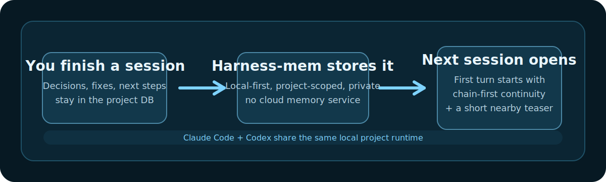

# Harness-mem

<p align="center">
  
</p>

<p align="center"><strong>Local project memory for AI coding sessions — a continuity runtime, not a generic memory API.</strong></p>

<p align="center">
  Harness-mem keeps a single local SQLite memory <em>per project</em> so the next Claude Code or Codex session opens on the thread you were already working on, instead of a blank slate. ~5ms cold start. Zero cloud, zero API keys.
</p>

<p align="center">
  <a href="https://www.npmjs.com/package/@chachamaru127/harness-mem"></a>
  <a href="https://www.npmjs.com/package/@chachamaru127/harness-mem"></a>
  <a href="https://github.com/Chachamaru127/harness-mem/actions/workflows/release.yml"></a>
  
  
  <a href="LICENSE"></a>
</p>

<p align="center">
  English | <a href="README_ja.md">日本語</a>
</p>

<p align="center">
  
</p>

---

## Table of Contents

- [What changes](#what-changes)
- [Measured](#measured)
- [Install](#install)
- [How it works](#how-it-works)
- [Compare with alternatives](#compare-with-alternatives)
- [Adaptive Retrieval Engine](#adaptive-retrieval-engine)
- [Measured Proof](#measured-proof) — full benchmark gate
- [Core Commands](#core-commands)
- [Supported Tools](#supported-tools)
- [Dual-Agent Coordination](#dual-agent-coordination)
- [Troubleshooting](#troubleshooting)
- [Release Reproducibility](#release-reproducibility)
- [Documentation](#documentation)
- [License](#license)

---

## What changes

<p align="center">
  
</p>

### 30-second version

Harness-mem gives Claude Code and Codex the same local project memory, so the next session can open on the thread you were already working on instead of a blank slate. It is built for people who switch tools inside the same project and do not want to re-explain the same decisions twice.

### 3-minute setup path

1. Run `npx -y --package @chachamaru127/harness-mem harness-mem setup --platform codex,claude`.
2. Run `npx -y --package @chachamaru127/harness-mem harness-mem doctor --platform codex,claude`.
3. Confirm both clients are green and point at the current checkout or install path.
4. Start a fresh Claude Code or Codex session and check that the first turn already knows the current thread.

### Trust block

- **Local-first**: the database lives on your machine at `~/.harness-mem/harness-mem.db`.
- **Privacy**: there is no cloud memory service, no API keys, and no off-machine upload just to remember context.
- **Private tags**: wrap any text in `<private>...</private>` and it is automatically stripped before storage — use this to keep secrets out of memory without disabling memory entirely.
- **Project isolation**: each project keeps its own memory lane, so one repo does not bleed into another.

### Support tiers

- **Strongest path: Claude Code + Codex**: this is the main experience we optimize for. Shared local runtime, first-turn continuity, and the clearest install / doctor flow.
- **Supported path: Cursor**: hooks and MCP work out of the box, but the continuity story is not as central as Claude Code + Codex.
- **Experimental path: OpenCode**: usable, but not the same parity promise.

### What this means in practice

- **You use Claude Code and Codex** → harness-mem gives both tools the same local project runtime. On supported hook paths, the first turn stays chain-first (`what we were just doing`) and can also surface a short `Also Recently in This Project` teaser for nearby context.
- **You care about privacy** → everything stays in `~/.harness-mem/harness-mem.db`. Zero cloud calls. No API keys required.
- **You also use Cursor** → hooks and MCP work out of the box, but it is tier 2 rather than the main continuity path.

---

## Measured

All numbers below come from committed artifacts you can rerun yourself — no marketing approximations.

| Metric | Value | Where it lives |
|---|---|---|
| **MCP cold start** | ~5ms (median, n=10) | [bench JSON](docs/benchmarks/go-mcp-bench/) · `scripts/bench-go-mcp.sh` |
| **Single Go binary** | 7.04MB stripped · 4 platforms | macOS arm64/amd64 · Linux amd64 · Windows amd64 |
| **Memory (RSS)** | ~13MB after `initialize` + `tools/list` | bench JSON, measured on Apple M1 |
| **LoCoMo F1** | 0.5917 (120 QA · 3-run PASS) | [run-ci manifest](memory-server/src/benchmark/results/ci-run-manifest-latest.json) |
| **Search p95** | 13.28ms | same manifest |
| **Bilingual recall@10** | 0.8800 | same manifest |

The Go MCP server is the layer Claude Code and Codex actually talk to. If the Go binary is missing, a wrapper script transparently falls back to the Node.js build — you still get every feature, just at Node.js cold start.

### What these numbers mean for you

- **~5ms cold start** means the memory layer should feel instant when you open or resume work.
- **Bilingual recall@10** means mixed Japanese, English, and code notes are still findable instead of splitting into separate piles.
- **Freshness@K = 1.00** means updated facts should replace stale ones instead of competing with them.
- **Developer-workflow recall** is the real user value: yesterday's migration, bug fix, or deployment decision should be recoverable when you need it again.

### harness-mem's target domain is developer workflow memory

Memory benchmarks cluster into two domains:

- **General lifelog** — remembering a fictional person's everyday life ("when did Caroline go to the support group?"). This is what **LoCoMo**, LongMemEval, and most of Mem0/MemPalace/SuperMemory evaluate.
- **Developer workflow** — remembering yesterday's race fix, the tech-stack decisions, the half-done migration, the deploy recipe. This is what harness-mem actually serves.

For commercial-safe external benchmarking, we keep `τ³-bench` and `SWE-bench Pro` in the first-line portfolio and keep `NoLiMa` in a separate research-only lane because its evaluation code and needle set are not licensed for commercial use.

**Where harness-mem actually competes**

Our release gate lives in `ci-run-manifest-latest.json` on the developer-workflow domain:

| Metric | Current | Target (main gate) | Measures |
|---|---:|---:|---|
| `dev-workflow` recall@10 | 0.59 | ≥ 0.70 | Developer-style file/decision jump queries |
| `bilingual` recall@10 | **0.88** | ≥ 0.90 | Mixed JA/EN/code retrieval |
| `knowledge-update` freshness@K | **1.00** | ≥ 0.95 ✓ | Supersede stale facts when content is updated |
| `temporal` ordering score | 0.65 | ≥ 0.70 | "When did X happen relative to Y?" on project history |

For general-lifelog comparisons (LoCoMo, LongMemEval, etc.), see each competitor's own published numbers — they target that domain and we do not.

Raw data of the general-lifelog landscape (source URLs, fetched dates, per-row notes for competitor scores) is kept as a machine-readable audit trail at [`docs/benchmarks/competitors-2026-04.json`](docs/benchmarks/competitors-2026-04.json).

Full benchmark gate (primary ship gate + Japanese companion + historical baseline) is in the [Measured Proof](#measured-proof) section below.

---

## Install

Pick the path that matches your stack. That's the whole decision.

| You use... | Run this |
|---|---|
| **Only Claude Code** | `/plugin marketplace add Chachamaru127/harness-mem` → `/plugin install harness-mem@chachamaru127` |
| **Claude Code + Codex** _(recommended first run)_ | `npx -y --package @chachamaru127/harness-mem harness-mem setup --platform codex,claude` → `npx -y --package @chachamaru127/harness-mem harness-mem doctor --platform codex,claude` |
| **Claude Code + Codex** _(persistent CLI)_ | `npm install -g @chachamaru127/harness-mem` → `harness-mem setup --platform codex,claude` → `harness-mem doctor --platform codex,claude` |

### Claude-harness companion mode

Claude-harness can manage harness-mem as an external companion instead of embedding memory internals. In that mode Claude-harness may call:

```bash
harness-mem setup --platform codex,claude --skip-quality --auto-update enable
harness-mem doctor --json --platform codex,claude
harness-mem recall off
harness-mem uninstall --platform codex,claude --purge-db
```

Local data stays in `~/.harness-mem/harness-mem.db`, and the runtime copy lives at `~/.harness-mem/runtime/harness-mem`. Purge is always explicit; automatic setup must never delete the DB. See [`docs/claude-harness-companion-contract.md`](docs/claude-harness-companion-contract.md).

### About `harness-mem setup`

`harness-mem setup` is **interactive**. It asks which tools to wire up:

```
[harness-mem] Select setup targets (multiple allowed)
  1) codex        (global: ~/.codex/config.toml)
  2) cursor       (global: ~/.cursor/hooks.json + ~/.cursor/mcp.json)
  3) opencode     (global: ~/.config/opencode/opencode.json)
  4) claude       (global: ~/.claude.json mcpServers)
  5) antigravity  (experimental workspace scanning)
  a) all
Example: 1,2   (Enter=1,2)
```

No `--platform` flag is required. For CI / scripted installs you can still pass `--platform codex,claude,cursor` to skip the prompt.

### Verify

```bash
harness-mem doctor
```

All green = ready. If something is off:

```bash
harness-mem doctor --fix
```

A green `doctor` plus active `SessionStart`, `UserPromptSubmit`, and `Stop` hooks is the runtime contract for first-turn continuity on Claude Code and Codex.

### Update

```bash
harness-mem update
```

Prompts for auto-update opt-in only when auto-update is currently disabled, then updates the global package. After a successful update, it also runs a quiet `doctor --fix` for remembered client platforms so stale wiring can self-heal.

<details>
<summary><strong>Windows (Git Bash / WSL2)</strong></summary>

If you are on Windows, there are now practical paths:

1. **Claude plugin route**: best option for Claude Code users on Windows.
2. **Git Bash + global install**: preferred native route for manual `setup` / `doctor`.
3. **MCP-only route**: if you only want Claude / Codex MCP wiring, run:

```bash
harness-mem mcp-config --write --client claude,codex
```

4. **WSL2**: still the most reliable full-lifecycle route.

If you use the Git Bash route, treat these as required prerequisites on Windows:

- `node` and `npm`
- `curl`
- `jq`
- `bun`
- `rg` (`ripgrep`)

Current validation status:

- Claude Code on Windows: validated with Git Bash
- Codex on Windows: Git Bash route validated for `setup --platform codex`, `doctor --platform codex`, exact hook commands, notify, and MCP connection
- `mcp-config` on Windows: available for MCP-only config updates; it does not validate the Codex hook lifecycle

</details>

<details>
<summary><strong>Running from a repo checkout (contributors)</strong></summary>

If you are running from a repo checkout and want a reproducible Codex-only bootstrap, use:

```bash
bash scripts/setup-codex-memory.sh
npm run codex:doctor
```

`setup` writes into user config locations like `~/.harness-mem`, `~/.codex`, `~/.claude*`, and `~/.cursor`. Running it as root can create the wrong ownership and wire the wrong home directory — do not use `sudo`.

For Codex specifically, the critical user-scoped files are `~/.codex/config.toml`, `~/.codex/hooks.json`, and the two skills under `~/.codex/skills/` (`harness-mem` and `harness-recall`). `doctor` now checks that those files still point at the current harness-mem checkout instead of an older absolute path or stale skill bundle.

Manual MCP sanity check:

Run from the harness-mem repo root when using the local checkout binary. For a global install, use `harness-mcp-server` instead of `./bin/harness-mcp-server`.

```bash
./bin/harness-mcp-server <<< '{"jsonrpc":"2.0","id":1,"method":"initialize","params":{"protocolVersion":"2024-11-05","capabilities":{},"clientInfo":{"name":"manual-check","version":"1"}}}'
codex mcp list
codex mcp get harness
```

</details>

---

## How it works

<p align="center">
  
</p>

- **One daemon** (`harness-memd`) listens on `localhost:37888`. It is the Go MCP server that Claude Code and Codex speak to over stdio.
- **One local SQLite database** at `~/.harness-mem/harness-mem.db` stores every observation, session thread, embedding, and fact chain.
- **Two hook paths** wire the tools in: `SessionStart` (first-turn continuity), `UserPromptSubmit` (contextual recall), and `Stop` (session finalization).
- **The memory server** (TypeScript) does embeddings, hybrid search, rerank, and the adaptive JA/EN/code routing. It is intentionally kept in TypeScript because that's where the ML stack lives — the Go layer is only the MCP front desk.

Large MCP search responses now also return `structuredContent`, so newer Claude / Codex clients can consume machine-readable results instead of only long JSON text.

### Current behavior today

- Claude Code and Codex share one local daemon and one local SQLite database.
- First-turn continuity is supported on the Claude Code and Codex hook paths after `harness-mem setup` and `harness-mem doctor` are green.
- On those supported hook paths, the default SessionStart artifact is hybrid: chain-first continuity stays on top, and a short recent-project teaser may appear second when there is distinct nearby work worth surfacing.
- If hook wiring or the local runtime is stale, search and recall can still work while the "open a fresh session and it already remembers" UX degrades.
- Experimental or maintenance-tier clients can still ingest/search, but parity with Claude Code and Codex is not claimed.

### What this does not claim

- Perfect automatic understanding for every brand-new session on every client.
- Parity on unsupported clients, broken hook wiring, or unhealthy local runtime.
- Perfect chain selection in every long-lived project with multiple mixed threads.
- A full project digest on every fresh session. The recent-project portion is intentionally capped to a few low-noise bullets.

### Inject actionability

A memory hint that the agent never acts on is just noise. harness-mem packages every inject (recall chain, contradiction warning, risk warning, skill suggestion) as a small `InjectEnvelope` with a `signals[]` list, persists each firing into a local `inject_traces` table, and reports `delivered_rate` and `consumed_rate` per session via the `harness_mem_observability` MCP tool. The CI tier gate blocks release when `delivered_rate < 95%` or `consumed_rate < 30%`, warns in the 30–60% band, and stays green at `consumed_rate ≥ 60%`. See [`docs/inject-envelope.md`](docs/inject-envelope.md) for the contract, the four inject paths, and known limits (substring grep, no synonym resolution, single-turn span).

---

## Compare with alternatives

Claude's built-in memory only works inside Claude. [claude-mem](https://github.com/thedotmack/claude-mem) adds persistence but is still locked to Claude Code. [Mem0](https://github.com/mem0ai/mem0) offers cross-app memory but requires cloud infrastructure and custom API integration. harness-mem takes a different path: one local project-scoped runtime, one SQLite database, and first-turn continuity across Claude Code and Codex with no cloud dependency.

| | harness-mem | Claude built-in | claude-mem | Mem0 |
|---|:---:|:---:|:---:|:---:|
| **Domain** | developer-workflow | generic-agent | generic-agent | general-lifelog |
| **Works across Claude Code + Codex** | ✓ | — | — | Manual per-app wiring |
| **Local-only, no cloud** | ✓ | — | ✓ | Cloud / paid self-host |
| **Setup** | 1 command (`setup`) | Built-in | npm install + config | SDK integration required |
| **MCP cold start** | **~5ms** (Go binary) | — | — | — |
| **Cost** | Free | Included in plan | Free | $99+/mo (cloud) |

> **Domain note:** `developer-workflow` = coding-session memory (harness-mem's target). `general-lifelog` = fictional daily-life conversation memory (LoCoMo / LongMemEval territory). `generic-agent` = general agent memory without strong domain focus. LoCoMo scores reflect `general-lifelog` performance and are not a direct comparison for developer-workflow tools.

<details>
<summary>Full comparison (all dimensions)</summary>

| | harness-mem | Claude built-in memory | claude-mem | Mem0 |
|---|:---:|:---:|:---:|:---:|
| **Domain** | developer-workflow | generic-agent | generic-agent | general-lifelog |
| **Supported tools** | Claude Code, Codex (Tier 1) · Cursor (Tier 2) · OpenCode (experimental) | Claude only | Claude only | Custom API integration |
| **Data storage** | Local SQLite | Anthropic cloud | Local SQLite + Chroma | Cloud (self-host on paid plan) |
| **Cross-tool memory** | Shared project-scoped local runtime + first-turn continuity on supported hook paths | N/A | N/A | Manual wiring per app |
| **Setup** | `harness-mem setup` (1 command) | Built-in | npm install + config | SDK integration required |
| **Search** | Hybrid (lexical + vector + nugget + recency + tag + graph + fact chain) | Undisclosed | FTS5 + Chroma vector | Vector-centric |
| **MCP server cold start** | ~5ms median (Go binary, measured) | — | — | — |
| **External dependencies** | Node.js + Bun (Go binary auto-downloaded) | None | Node.js + Python + uv + Chroma | Python + API keys |
| **Migration path** | `import-claude-mem` → `verify` → `cutover` | — | — | — |
| **Workspace isolation** | Strict (symlink-resolved paths) | Global | Basename only | Per-user / per-agent |
| **Benchmark (F1)** | 0.5917 (LoCoMo 120Q, 3-run PASS, p95 13.28ms) *(general-lifelog reference, not target)* | — | — | — |
| **Cross-tool transfer** | Recall@10: 0.60 | N/A | N/A | N/A |
| **Cost** | Free (local) | Included in Claude plan | Free | $99+/mo (cloud) |

> **Domain note:** `developer-workflow` = coding-session memory (harness-mem's target). `general-lifelog` = fictional daily-life conversation memory (LoCoMo / LongMemEval territory). `generic-agent` = general agent memory without strong domain focus. LoCoMo scores reflect `general-lifelog` performance and are not a direct comparison for developer-workflow tools.

</details>

---

## Adaptive Retrieval Engine

Harness-mem also includes an `adaptive` embedding mode for teams that mix Japanese, English, and code in the same project.

What it does:

- Route A: Japanese-heavy queries go to the Japanese model.
- Route B: English-heavy or code-heavy queries go to the general model.
- Route C: Mixed queries search both routes and fuse the scores.
- Query expansion adds a few controlled synonyms, so `本番反映` can still find notes written as `deploy`.

Why this exists:

- A single embedding model is usually a compromise.
- Japanese-focused models are often better for Japanese nuance.
- General-purpose models are often better for English API names, logs, and code-like text.
- Adaptive routing lets harness-mem choose the better path per query instead of forcing one model to do everything.

Free path vs Pro path:

- Free path: local Japanese route + local or fallback general route. No external API required.
- Pro path: set `HARNESS_MEM_PRO_API_KEY` and `HARNESS_MEM_PRO_API_URL` to enable the remote general route. If that route becomes unhealthy, harness-mem automatically falls back to the free path and retries with exponential backoff.

Quick example:

```bash
export HARNESS_MEM_EMBEDDING_PROVIDER=adaptive
export HARNESS_MEM_ADAPTIVE_JA_THRESHOLD=0.85
export HARNESS_MEM_ADAPTIVE_CODE_THRESHOLD=0.50

# optional: enable Pro path
export HARNESS_MEM_PRO_API_KEY=your-token
export HARNESS_MEM_PRO_API_URL=https://example.com/embeddings
```

Useful commands:

```bash
npm run benchmark
npm run benchmark:tune-adaptive
```

More detail:

- [`docs/adaptive-retrieval.md`](docs/adaptive-retrieval.md)
- [`docs/pro-api-data-policy.md`](docs/pro-api-data-policy.md)
- [`docs/environment-variables.md`](docs/environment-variables.md)

---

## Measured Proof

Primary release gate, current Japanese companion, and historical baseline are intentionally separated.

### Primary release gate (`run-ci`, current latest)

Source:
- [`memory-server/src/benchmark/results/ci-run-manifest-latest.json`](memory-server/src/benchmark/results/ci-run-manifest-latest.json)
- [`docs/benchmarks/japanese-release-proof-bar.md`](docs/benchmarks/japanese-release-proof-bar.md)

Current latest run:
- generated_at: `2026-04-10T08:10:51.561Z`
- git_sha: `512f027`
- embedding: `onnx`

| Metric | Value |
|---|---:|
| LoCoMo F1 | 0.5917 |
| Bilingual recall@10 | 0.8800 |
| Freshness | 1.0000 |
| Temporal | 0.6458 |
| Search p95 | 13.28ms |
| Token avg | 427.75 |

Verdict: `PASS`

Latest onnx run passed the current release gate. The companion Japanese proof remains a separate artifact-backed evidence pack rather than a replacement for `run-ci`.

### Japanese companion gate (`96 QA`, current claim source)

Source:
- [`docs/benchmarks/japanese-release-proof-bar.md`](docs/benchmarks/japanese-release-proof-bar.md)
- [`docs/benchmarks/artifacts/s43-ja-release-v2-latest/summary.json`](docs/benchmarks/artifacts/s43-ja-release-v2-latest/summary.json)
- [`docs/benchmarks/artifacts/s43-ja-release-v2-latest/run3/companion-gate.json`](docs/benchmarks/artifacts/s43-ja-release-v2-latest/run3/companion-gate.json)

| Metric | Value |
|---|---:|
| Overall F1 mean | 0.6580 |
| Cross-lingual F1 mean | 0.6850 |
| Zero-F1 count | 16 / 96 |
| 3-run span | 0.0000 |
| Current slice F1 | 0.8171 |
| Exact slice F1 | 0.5628 |
| Why slice F1 | 0.9008 |
| List slice F1 | 0.7564 |
| Temporal slice F1 | 0.6776 |

Verdict: `PASS as companion gate`

Residual risks that stay visible:
- `current_vs_previous`, `relative_temporal`, `yes_no`, `entity`, and `location` remain watch slices.
- This companion gate supports README-safe Japanese claims, but it does not replace `run-ci`.

### Historical baseline (`32 QA`, historical only)

Source:
- [`docs/benchmarks/artifacts/s40-ja-baseline-latest/summary.json`](docs/benchmarks/artifacts/s40-ja-baseline-latest/summary.json)
- [`docs/benchmarks/artifacts/s40-ja-baseline-latest/repro-report.json`](docs/benchmarks/artifacts/s40-ja-baseline-latest/repro-report.json)

| Metric | Value |
|---|---:|
| Overall F1 mean | 0.8020 |
| Cross-lingual F1 mean | 0.7563 |
| Zero-F1 count | 1 / 32 |
| 3-run span | 0.0000 |

This baseline shows where the earlier README proof bar landed, but it is **not** the current Japanese claim source.

What this supports:
- Cross-lingual EN<->JA retrieval is benchmarked.
- Japanese short-answer quality is measured on dedicated release packs.
- `why`, `current`, `list`, and `temporal` are all measured with artifact-backed slice reports.

What this does **not** claim:
- Native-level Japanese quality
- Perfect Japanese temporal reasoning
- A replacement for the main `run-ci` ship gate

### Sample Japanese queries

- `今、使っている CI は何ですか？`
- `email だけの運用をやめた理由は何ですか？`
- `Q2 に出した admin 向け機能をすべて挙げてください。`
- `最後に出た機能は何ですか？`

---

## Core Commands

| Command | Purpose |
|---|---|
| `setup` | Configure tool wiring and start daemon + Mem UI (interactive by default) |
| `doctor` | Validate wiring/health and optionally repair with `--fix` |
| `recall` | Switch contextual recall mode (`on`, `quiet`, `off`, `status`) |
| `versions` | Snapshot local vs upstream tool versions |
| `update` | Update global package; prompt auto-update opt-in only if currently disabled |
| `smoke` | Run isolated privacy/search sanity checks |
| `uninstall` | Remove wiring and optional local DB (`--purge-db`) |
| `import-claude-mem` + `verify-import` + `cutover-claude-mem` | Safe migration from Claude-mem |

`doctor --json` emits the `doctor.v2` schema. It keeps the old top-level fields while adding `overall_status`, per-check `result` (`pass`, `warn`, `fail`, `skip`), and a repair plan. Useful modes:

```bash
harness-mem doctor --json --read-only
harness-mem doctor --json --strict-exit
harness-mem doctor --fix --plan
```

Release-readiness helpers:

```bash
scripts/s105-retrieval-ab-gate.sh
scripts/s105-proof-bundle.sh --isolated-home --out-dir artifacts/s105-proof-bundle
```

### Contextual recall ("Banto mode")

`UserPromptSubmit` can surface a short memory whisper when the prompt looks like a file-path jump, error investigation, or decision point.

```bash
harness-mem recall status
harness-mem recall quiet
harness-mem recall on
harness-mem recall off
```

- `quiet` is the default. It is conservative: high rerank threshold when reranking is available, otherwise only the top recall item.
- `on` is more proactive: lower rerank threshold and up to 3 fallback items when reranking is unavailable.
- `off` disables contextual recall while keeping normal search and SessionStart continuity intact.
- `HARNESS_MEM_WHISPER_MAX_TOKENS` controls the per-prompt recall budget. See [`docs/environment-variables.md`](docs/environment-variables.md).

### `/harness-recall` Skill (Claude Code, since v0.15.0)

Claude Code users get a Skill that auto-fires when you naturally ask to recall something. Trigger phrases include `思い出して` / `覚えてる` / `前回` / `続き` / `直近` / `最後に` / `先ほど` / `さっき` / `resume` / `recall`.

The Skill routes your intent to the right memory source so you don't have to pick:

- continuation / resume → `harness_mem_resume_pack`
- decisions / methodology → `.claude/memory/decisions.md` + `patterns.md` (SSOT)
- same problem seen before → `harness_cb_recall`
- recent session list → `harness_mem_sessions_list`
- specific keyword → `harness_mem_search`

Output always starts with a `source:` line so you can judge freshness (auto-memory is marked point-in-time; live decisions come from SSOT). No user-side configuration required — `scripts/userprompt-inject-policy.sh` detects `RECALL_KEYWORDS` and promotes Skill invocation on every matching `UserPromptSubmit`.

This is orthogonal to "Banto mode" above: Banto runs on every prompt (advisory whisper), `/harness-recall` only runs on explicit recall intent (directed query).

### Mem UI

```bash
open 'http://127.0.0.1:37901'
```

The Mem UI includes an `Environment` tab that explains internal servers, installed languages/runtimes, CLI tools, and AI/MCP wiring status. Read-only in V1, sensitive values are masked before rendering.

---

## Supported Tools

| Tier | Tool | Tested With | Notes |
|---|---|---|---|
| **Tier 1** | Claude Code | v2.1.80 | Full hook lifecycle (18 events incl. StopFailure), MCP, plugin marketplace, `--channels` push, `--inline-plugin` setup |
| **Tier 1** | Codex CLI | v0.116.0+; verified through v0.130.0 | SessionStart + UserPromptSubmit + Stop hooks, MCP, memory citation, structured MCP result, rules. v0.130.0 additive metadata and paged thread summary ingest are tolerated; remote-control and plugin sharing remain Codex-owned |
| **Tier 2** | Cursor | Latest | hooks.json + sandbox.json + MCP. No new investment beyond maintenance |
| **Tier 3** | OpenCode | Latest | Experimental. Community-contributed |

---

## Dual-Agent Coordination

Running Claude Code and Codex CLI side-by-side on the same repo works out of
the box: both agents see the same memory via `harness-mem`, and two coordination
primitives keep them from stepping on each other.

**Lease** — claim a file, an action, or any key for a bounded TTL. A second
agent attempting to claim the same target gets `already_leased` with the
current holder and expiry.

**Signal** — point-to-point or broadcast messaging. Unacked signals come back
from `_read`; `reply_to` threads a conversation; TTL auto-expires stale
messages.

```jsonc
// Claude grabs a lease before refactoring auth.ts
{ "tool": "harness_mem_lease_acquire",
  "args": { "target": "file:/src/auth.ts", "agent_id": "claude-1", "ttl_ms": 600000 } }
// Codex sees the busy lease and redirects
{ "tool": "harness_mem_lease_acquire",
  "args": { "target": "file:/src/auth.ts", "agent_id": "codex-1" } }
// → { "ok": false, "error": "already_leased", "heldBy": "claude-1", "expiresAt": "..." }

// Claude pings Codex when the refactor is done
{ "tool": "harness_mem_signal_send",
  "args": { "from": "claude-1", "to": "codex-1", "content": "auth.ts refactor ready for review" } }
// Codex pulls pending signals on next turn
{ "tool": "harness_mem_signal_read",  "args": { "agent_id": "codex-1" } }
// → [{ signal_id, from: "claude-1", content: "auth.ts refactor ready for review", ... }]
{ "tool": "harness_mem_signal_ack",  "args": { "signal_id": "...", "agent_id": "codex-1" } }
```

`harness-mem doctor` probes both `/v1/lease/acquire` and `/v1/signal/read` so
mis-configured daemons surface early.

---

## Troubleshooting

### `harness-mem: command not found`

```bash
npx -y --package @chachamaru127/harness-mem harness-mem setup
```

### `doctor` reports missing dependencies

`bun` and `ripgrep` are auto-installed on macOS during setup. For other tools (`node`, `curl`, `jq`), install them manually and run:

```bash
harness-mem doctor --fix
```

### Same workspace appears as both `harness-mem` and `/.../harness-mem`

```bash
harness-memd restart
```

### You already used `sudo` and ownership is broken

Typical symptom: later `setup` or `doctor --fix` only works with `sudo`, because files under your home directory became root-owned.

```bash
sudo chown -R "$USER":staff ~/.harness-mem ~/.codex ~/.cursor ~/.claude ~/.claude.json 2>/dev/null || true
harness-mem setup
harness-mem doctor --fix
```

Adjust the group if your machine does not use `staff`.

### Need a clean reset

```bash
harness-mem uninstall --purge-db
```

---

## Release Reproducibility

If you maintain this repo, release quality should not depend on whether you used a skill, a shell script, or a manual checklist.

- Normal feature work goes to `CHANGELOG.md` under `## [Unreleased]`.
- `CHANGELOG.md` is the source of truth for release notes. `CHANGELOG_ja.md` is a Japanese summary, not a separate contract.
- The release contract is the same whether you use the `harness-release` skill or run the commands yourself: `package.json` version, changelog entry, git tag, GitHub Release, and npm publish must all refer to the same version.
- The canonical maintainer checklist lives in [`docs/release-process.md`](docs/release-process.md).
- The test execution details, including the Bun panic mitigation path used by `npm test`, live in [`docs/TESTING.md`](docs/TESTING.md).
- If you need the maintainer-facing repro notes for the known Bun teardown crash, see [`docs/bun-test-panic-repro.md`](docs/bun-test-panic-repro.md).

In practice, a reproducible release means all of these are true before you ship:

1. Working tree is clean.
2. User-visible changes are already written in `CHANGELOG.md` under `[Unreleased]`.
3. Quality gates are green.
4. `npm pack --dry-run` passes.
5. The release tag matches `package.json`.
6. The resulting npm version and GitHub Release point to the same shipped version.

---

## Plans.md Workflow

harness-mem uses `Plans.md` as the single source of truth for task management.

### Phase markers

| Marker | Meaning |
|---|---|
| `cc:TODO` | Not started |
| `cc:WIP` | Work in progress |
| `cc:完了` | Worker completed |
| `blocked` | Blocked (reason noted) |

### When starting a task

Update the marker from `cc:TODO` to `cc:WIP` in Plans.md before beginning implementation. Each Phase groups related tasks that can be executed in parallel.

### When complete

Update the marker to `cc:完了` and note any unresolved issues.

---

## Phase B Capabilities (April 2026)

Phase B (April 2026) added verbatim raw storage (`HARNESS_MEM_RAW_MODE=1`), hierarchical metadata scoping for multi-session projects, and token-budgeted L0/L1 wake-up context that cuts SessionStart token cost while preserving first-turn continuity. All three features are opt-in or backward-compatible — existing deployments need no configuration changes. See [Phase B capabilities](docs/benchmarks/phase-b-capabilities-2026-04-18.md) for landed commits, baseline measurements, and deferred items.

---

## Documentation

- Setup reference: [`docs/harness-mem-setup.md`](docs/harness-mem-setup.md)
- Onboarding checklist: [`docs/onboarding-checklist.md`](docs/onboarding-checklist.md)
- README claim map: [`docs/readme-claims.md`](docs/readme-claims.md)
- Onboarding dry-run notes: [`docs/onboarding-dry-run.md`](docs/onboarding-dry-run.md)
- Doctor UX follow-up scope: [`docs/doctor-ux-scope.md`](docs/doctor-ux-scope.md)
- Commercial-safe benchmark portfolio: [`docs/benchmarks/commercial-benchmark-portfolio.md`](docs/benchmarks/commercial-benchmark-portfolio.md)
- 30 USD direct-API pilot runbook: [`docs/benchmarks/pilot-30usd-direct-api.md`](docs/benchmarks/pilot-30usd-direct-api.md)
- τ³-bench runbook: [`docs/benchmarks/tau3-runbook.md`](docs/benchmarks/tau3-runbook.md)
- SWE-bench Pro memory ablation: [`docs/benchmarks/swebench-pro-memory-ablation.md`](docs/benchmarks/swebench-pro-memory-ablation.md)
- Environment API contract: [`docs/plans/environment-tab-v1-contract.md`](docs/plans/environment-tab-v1-contract.md)
- Changelog (source of truth): [`CHANGELOG.md`](CHANGELOG.md)
- Japanese changelog summary: [`CHANGELOG_ja.md`](CHANGELOG_ja.md)
- Japanese README: [`README_ja.md`](README_ja.md)
- Benchmark runbooks: [`docs/benchmarks/`](docs/benchmarks/)
- Go MCP server bench proof: [`docs/benchmarks/go-mcp-bench/`](docs/benchmarks/go-mcp-bench/)

---

## Official Mascot

<p align="center">
  
</p>

---

## Maintained by

<p align="center">
  Developed and maintained by <a href="https://canai.jp/">CAN AI Inc.</a><br />
  AI adoption consulting — helping organizations build lasting AI capabilities.
</p>

---

## License

Business Source License 1.1 (SPDX: `BUSL-1.1`). See [`LICENSE`](LICENSE).

**Permitted**: internal use, personal use, development, testing, open-source projects, embedding as a component in your application.

**Restricted**: offering harness-mem as a managed memory service to third parties.

On **2029-03-08**, the license automatically converts to **Apache License 2.0**.

**FAQ**:
- *Can I use harness-mem at work?* — Yes. Internal use within your organization is permitted.
- *Can I build a product that uses harness-mem?* — Yes, as a component. You cannot offer harness-mem itself as a hosted memory service.
- *What happens after 2029?* — The license converts to Apache 2.0. No action needed.

**Metadata note**: The repository root is BUSL-1.1. Some distributable subpackages keep their own package-level SPDX fields (for example MIT in `sdk/`, `mcp-server/`, and `vscode-extension/`). If a GitHub repo header or API shows `Other` / `NOASSERTION`, treat [`LICENSE`](LICENSE) and each package's `package.json` as the authoritative source.
