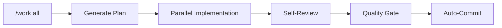

<p align="center">
  
</p>

<p align="center">
  <strong>Plan. Work. Review. Ship.</strong><br>
  <em>Turn Claude Code into a disciplined development partner.</em>
</p>

<p align="center">
  <a href="VERSION"></a>
  <a href="LICENSE.md"></a>
  <a href="docs/CLAUDE_CODE_COMPATIBILITY.md"></a>
  
</p>

<p align="center">
  English | <a href="README_ja.md">日本語</a>
</p>

---

## Why Harness?

Claude Code is powerful—but sometimes it needs structure.

| Without Harness | With Harness |
|-----------------|--------------|
| Jumps into code immediately | Plans first, then executes |
| Reviews only when asked | Auto-reviews every change |
| Forgets past decisions | SSOT files preserve context |
| `rm -rf` runs without warning | Dangerous commands blocked |
| One task at a time | Parallel workers |

**Three commands. One workflow. Production-ready code.**


---

## Requirements

- **Claude Code v2.1+** ([Install Guide](https://docs.anthropic.com/claude-code))
- **Node.js 18+** (for safety hooks)

---

## Install in 30 Seconds

```bash
# Start Claude Code in your project
claude

# Add the marketplace & install
/plugin marketplace add Chachamaru127/claude-code-harness
/plugin install claude-code-harness@claude-code-harness-marketplace

# Initialize your project
/harness-init
```

That's it. Start with `/plan-with-agent`.

---

## Codex CLI Setup

Use Codex CLI with Team Config (shared `.codex/`):

1. Copy `codex/.codex` into your project as `.codex`
2. Copy `codex/AGENTS.md` into your project root as `AGENTS.md`
3. Optional: copy `codex/.codex/config.toml` and set the MCP server path

Script setup:

```bash
/path/to/claude-code-harness/scripts/setup-codex.sh
```

Claude Code users can run `/setup codex` to apply it without leaving the session.

Use `$plan-with-agent`, `$work`, `$harness-review` to run the workflow.

## Unified Memory Setup (Claude/Codex/OpenCode shared)

```bash
# from your project
/path/to/claude-code-harness/scripts/harness-mem setup
```

This wires platform adapters, starts `harness-memd`, and runs smoke + search quality checks.

---

## 🪄 TL;DR: Work All

**Don't want to read all this?** Just type:

```
/work all
```

**One command. Harness does the rest.** Plan → Parallel Implementation → Review → Commit.



| Before | After |
|--------|-------|
| `/plan-with-agent` → `/work` → `/harness-review` → `git commit` | `/work all` |
| 4 commands | **1** |

> ⚠️ **Experimental**: Once you approve the plan, Claude runs to completion. Quality gate blocks commit if issues found.

---

## The Core Loop (Details)

### 1. Plan

```bash
/plan-with-agent
```

> "I want a login form with email validation"

Harness creates `Plans.md` with clear acceptance criteria.

### 2. Work

```bash
/work              # Auto-detect parallelism
/work --parallel 5 # 5 workers simultaneously
```

Each worker implements, self-reviews, and reports.

### 3. Review

```bash
/harness-review
```

| Perspective | Focus |
|-------------|-------|
| Security | Vulnerabilities, injection, auth |
| Performance | Bottlenecks, memory, scaling |
| Quality | Patterns, naming, maintainability |
| Accessibility | WCAG compliance, screen readers |

---

## Safety First

Harness protects your codebase with hooks:

| Protected | Action |
|-----------|--------|
| `.git/`, `.env`, secrets | Write blocked |
| `rm -rf`, `sudo`, `--force` | Confirmation required |
| `git status`, `npm test` | Auto-allowed |
| Test tampering | Warning triggered |

---

## 45 Skills, Zero Config

Skills auto-load based on context. Use slash commands or natural language.

| Say This | Skill |
|----------|-------|
| "implement login" | `impl` |
| "review this code" | `harness-review` |
| "fix the build error" | `verify` |
| "add Stripe payments" | `auth` |
| "deploy to Vercel" | `deploy` |

### Key Commands

| Command | What It Does |
|---------|--------------|
| `/plan-with-agent` | Ideas → `Plans.md` |
| `/work` | Execute tasks in parallel |
| `/harness-review` | 4-perspective review |
| `/harness-init` | Initialize project |
| `/sync-status` | Check progress |
| `/memory` | Manage SSOT files |

---

## Who Is This For?

| You Are | Harness Helps You |
|---------|-------------------|
| **Developer** | Ship faster with built-in QA |
| **Freelancer** | Deliver review reports to clients |
| **Indie Hacker** | Move fast without breaking things |
| **VibeCoder** | Build apps with natural language |
| **Team Lead** | Enforce standards across projects |

---

## Architecture

```
claude-code-harness/
├── skills/       # 45 skill definitions
├── agents/       # 8 sub-agents (parallel workers)
├── hooks/        # Safety & automation
├── scripts/      # Guard scripts
└── templates/    # Generation templates
```

---

## Advanced Features

<details>
<summary><strong>Codex Engine</strong></summary>

Delegate implementation tasks to OpenAI Codex in parallel:

```bash
/work --codex implement these 5 API endpoints
```

Codex implements → Self-reviews → Reports back. Works alongside Claude Code workers.

> **Setup required**: Install [Codex CLI](https://github.com/openai/codex) and configure API key.

</details>

<details>
<summary><strong>2-Agent Mode (with Cursor)</strong></summary>

Use Cursor as PM, Claude Code as implementer.

```bash
/handoff       # Report to Cursor PM
```

Plans.md syncs between both.

</details>

<details>
<summary><strong>Codex Review Integration</strong></summary>

Add OpenAI Codex for second opinions:

```bash
/harness-review  # 4 perspectives + Codex
```

Codex selects 4 relevant experts from 16 specialist types.

</details>

<details>
<summary><strong>Video Generation</strong></summary>

Generate product videos with JSON Schema-driven pipeline:

```bash
/generate-video
```

- JSON Schema as SSOT (Single Source of Truth)
- 3-layer validation: scene → scenario → E2E
- Remotion-based rendering with deterministic output

> **Dependencies**: Requires [Remotion](https://www.remotion.dev/) project setup and ffmpeg.

</details>

<details>
<summary><strong>Agent Trace</strong></summary>

Automatically tracks AI-generated code edits:

```
.claude/state/agent-trace.jsonl
```

- Records every Edit/Write operation
- Shows project name, current task, recent edits at session end
- Enables `/sync-status` to compare Plans.md with actual changes

No setup required—enabled by default.

</details>

---

## Troubleshooting

| Issue | Solution |
|-------|----------|
| Command not found | Run `/harness-init` first |
| Plugin not loading | Clear cache: `rm -rf ~/.claude/plugins/cache/claude-code-harness-marketplace/` and restart |
| Hooks not working | Ensure Node.js 18+ is installed |

For more help, [open an issue](https://github.com/Chachamaru127/claude-code-harness/issues).

---

## Uninstall

```bash
/plugin uninstall claude-code-harness
```

Project files (Plans.md, SSOT files) remain unchanged.

---

## Documentation

| Resource | Description |
|----------|-------------|
| [Changelog](CHANGELOG.md) | Version history |
| [Claude Code Compatibility](docs/CLAUDE_CODE_COMPATIBILITY.md) | Requirements |
| [Cursor Integration](docs/CURSOR_INTEGRATION.md) | 2-Agent setup |

---

## Contributing

Issues and PRs welcome. See [CONTRIBUTING.md](CONTRIBUTING.md).

---

## Acknowledgments

- [AI Masao](https://note.com/masa_wunder) — Hierarchical skill design
- [Beagle](https://github.com/beagleworks) — Test tampering prevention patterns

---

## License

**MIT License** — Free to use, modify, commercialize.

[English](LICENSE.md) | [日本語](LICENSE.ja.md)
