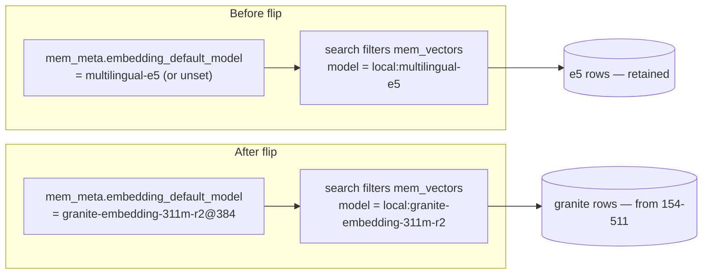

# S154-512 Granite Embedding Flag Flip Runbook

Operational runbook for switching the live embedding default from
`multilingual-e5` to `granite-embedding-311m-r2@384` after S154-511 backfill
completes. **This document is preparation-only until an operator executes the
steps.**

## Safety constraints (non-negotiable)

| Rule | Rationale |
|------|-----------|
| Do **not** flip until preflight passes | Backfill verification is the gate |
| Do **not** delete or rewrite `local:multilingual-e5` vector rows | Instant rollback depends on both indexes coexisting (S154-403 / D29) |
| Do **not** run flip while another job is writing the live DB without coordination | Avoid mem_meta / ingest races; prefer a maintenance window |
| `HARNESS_MEM_EMBEDDING_MODEL` must be unset in daemon env | Explicit env pins override the mem_meta flag (`registry.ts`) |
| Vector store dimension must stay **384** | Flag `@384` is rejected when store dimension mismatches (`registry.ts`) |

## Architecture (what actually changes)



Flag wiring (S154-510):

- **Writer**: `setEmbeddingDefaultModel()` in `memory-server/src/core/config-manager.ts`
  — single `mem_meta` upsert on key `embedding_default_model`, catalog format
  validation via `parseEmbeddingDefaultModelFlag()`.
- **Reader**: `createEmbeddingProviderRegistry()` in
  `memory-server/src/embedding/registry.ts` — reads the same mem_meta key when
  `HARNESS_MEM_EMBEDDING_MODEL` is unset and config model is the incumbent.
- **Flip target value**: `granite-embedding-311m-r2@384` (MRL 384; native catalog
  dimension is 768).
- **Rollback value**: `multilingual-e5` (bare id; resolves to native 384-dim e5).

Provider init happens at daemon startup (`HarnessMemCore.initEmbeddingProvider`).
**Restart the daemon after every flag change.**

## Phase 0 — Prerequisites

### 0.1 Backfill artifact gate (read-only)

The 154-511 job writes:

`docs/benchmarks/artifacts/s154-granite-backfill/verification.json`

Run the read-only preflight (opens the artifact JSON only — **not** the live DB):

```bash
~/.bun/bin/bun run scripts/s154-granite-flip-preflight.ts
```

Exit **0** requires all of:

| Check | Field |
|-------|-------|
| Backfill verification passed | `verification.passed === true` |
| sqlite-vec loaded during backfill | `verification.sqlite_vec_available === true` |
| Sidecar parity | `verification.sidecar_rows === verification.granite_rows` |

On failure: re-run or resume backfill (`scripts/s154-granite-backfill.ts`) — out
of scope for this runbook section.

### 0.2 Model install

Granite must be present under the local models dir or the registry fail-safes
back to e5:

```bash
bash scripts/harness-mem model pull granite-embedding-311m-r2 --yes
```

### 0.3 Daemon / config sanity

```bash
scripts/harness-mem doctor
scripts/harness-memd status
```

Confirm:

- `vectorDimension` / effective store dimension is **384** (default in this repo).
- LaunchAgent / shell env does **not** set `HARNESS_MEM_EMBEDDING_MODEL`.
- `~/.harness-mem/config.json` `embedding_model` is `multilingual-e5` or unset
  (config file model is overridden by mem_meta flag when unpinned).

### 0.4 Capture D29 baseline (e5 era)

Before any flip, capture ordered search results while still on e5. Edit probe
projects in `docs/benchmarks/fixtures/s154-512-rollback-probes.json`, then:

```bash
~/.bun/bin/bun run scripts/s154-embedding-rollback-drill.ts capture \
  --db ~/.harness-mem/harness-mem.db \
  --probes docs/benchmarks/fixtures/s154-512-rollback-probes.json \
  --out /tmp/s154-512-baseline-e5.json
```

Store the capture path in operator notes — required for rollback drill.

## Phase 1 — Flag flip (execution time)

> **Do not run during P4 prep.** Steps documented for the maintenance window.

1. **Optional backup**

   ```bash
   curl -sf -X POST http://127.0.0.1:${HARNESS_MEM_PORT:-8787}/v1/admin/backup \
     -H "Authorization: Bearer ${HARNESS_MEM_REMOTE_TOKEN:-}"
   ```

2. **Dry-run flag write**

   ```bash
   ~/.bun/bin/bun run scripts/s154-granite-flag-set.ts \
     --dry-run --to granite-embedding-311m-r2@384
   ```

   Expect JSON with `"previous": "multilingual-e5"` (or current value) and
   `"next": "granite-embedding-311m-r2@384"`.

3. **Execute flag write**

   ```bash
   ~/.bun/bin/bun run scripts/s154-granite-flag-set.ts \
     --execute --to granite-embedding-311m-r2@384
   ```

   Equivalent audited API: `ConfigManager.setEmbeddingDefaultModel("granite-embedding-311m-r2@384")`
   (`config-manager.ts:522-527`).

4. **Restart daemon**

   ```bash
   scripts/harness-memd restart
   ```

5. **Post-flip smoke**

   ```bash
   scripts/harness-mem doctor
   curl -sf "http://127.0.0.1:${HARNESS_MEM_PORT:-8787}/health" | jq .
   ```

   Health / metrics should show vector model
   `local:granite-embedding-311m-r2` (not e5). Investigate registry warnings if
   fallback to e5 is logged.

## Phase 2 — Non-regression gates (execution time)

Run after flip; **commands listed for operators — not executed during prep.**

### 2.1 Developer-domain manifest (S108 + S154-103 CJK aggregation)

```bash
npm run benchmark:developer-domain
```

Pass criterion: JSON output / manifest reports `overall_passed: true`.

Optional CI gate script:

```bash
bash scripts/check-developer-domain-gate.sh
```

Key sub-gates include `dev_workflow`, `temporal_order`, `japanese_temporal_slice`,
`cjk_discrimination`, and `flagship_freshness` (see
`scripts/s108-developer-domain-manifest.ts`).

### 2.2 CJK discrimination gate (S154-152) — explicit non-regression

The developer-domain runner already invokes 154-152 internally. For a standalone
evidence artifact:

```bash
~/.bun/bin/bun run scripts/s154-cjk-discrimination-gate.ts --no-write
```

Pass criterion: `overall_passed: true`, no slice with `decision: "regressed"`.
Artifact schema: `docs/benchmarks/artifacts/s154-cjk-discrimination/summary.json`
when `--no-write` is omitted.

## Phase 3 — Rollback drill (execution time)

See [s154-512-rollback-drill.md](./s154-512-rollback-drill.md) for the full D29
procedure. Summary:

1. Flip flag back: `--execute --to multilingual-e5`
2. `scripts/harness-memd restart`
3. Compare searches to Phase 0.4 baseline:

   ```bash
   ~/.bun/bin/bun run scripts/s154-embedding-rollback-drill.ts compare \
     --db ~/.harness-mem/harness-mem.db \
     --probes docs/benchmarks/fixtures/s154-512-rollback-probes.json \
     --baseline /tmp/s154-512-baseline-e5.json
   ```

   Pass: `"passed": true`, `"mismatches": []`.

4. If drill passes, re-flip to granite (`--execute --to granite-embedding-311m-r2@384`)
   + restart to restore production intent.

## Evidence checklist

Record flip evidence using [s154-512-flip-evidence-checklist.md](./s154-512-flip-evidence-checklist.md)
(Plans.md + harness-mem).

## References

| Item | Location |
|------|----------|
| Backfill CLI | `scripts/s154-granite-backfill.ts` |
| Preflight (read-only) | `scripts/s154-granite-flip-preflight.ts` |
| Flag setter template | `scripts/s154-granite-flag-set.ts` |
| Rollback drill helper | `scripts/s154-embedding-rollback-drill.ts` |
| Flag tests | `memory-server/tests/integration/embedding-switch-flag.test.ts` |
| Plans task | `Plans.md` §154-512 |
| D29 switch decision | `memory-server/src/embedding/switch-decision.ts`, `data/composite-score-weights.json` |
